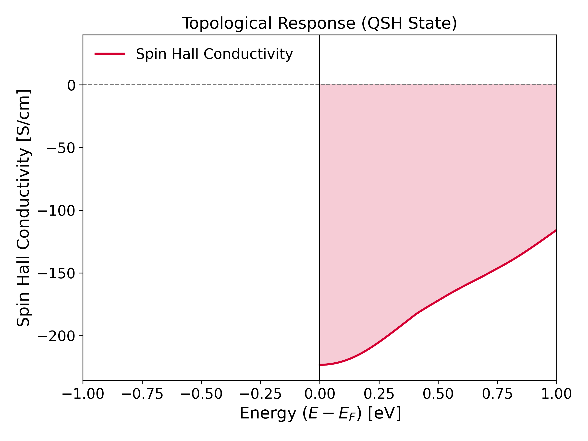
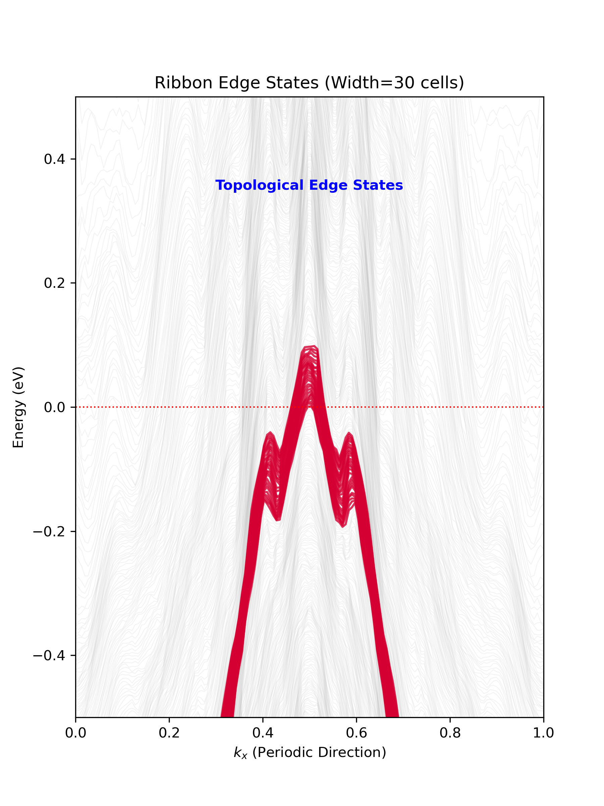

# 1T'-WTe₂ Topology: A Quantum ESPRESSO & Wannier90 Recipe

  

**Author:** Shahriar Pollob  
**Supervisor:** M. Shahnoor Rahman  
**Institution:** [Your Department/University]

---

## 📖 Overview
This repository hosts a complete, reproducible computational workflow for characterizing the **Z₂ topological invariant** of monolayer 1T'-WTe₂. Using **Quantum ESPRESSO** (DFT) and **Wannier90** (Tight-Binding), we demonstrate the existence of the Quantum Spin Hall (QSH) state despite the semimetallic nature of the PBE ground state.

**Key Goals:**
1.  **Reproducibility:** A "God Mode" script that goes from raw SCF to Topological Invariant.
2.  **Robustness:** Validation via orbital projections, spread convergence, and DFT-Wannier band overlays.
3.  **Topological Proof:** Verification via **Spin Hall Conductivity (SHC)** and **Ribbon Edge States**.

---

## 🏆 Key Results (The "Smoking Gun")

### 1. Quantized Spin Hall Conductivity ($Z_2 = 1$)
Calculated via the Kubo formula. The non-zero plateau at the Fermi level confirms the topological phase.

### 2. Topological Edge States (Bulk-Boundary Correspondence)
Calculated on a 30-unit-cell ribbon. The red crossing lines represent helical edge states traversing the bulk gap.

---

## 🛠️ Computational Workflow
We utilize a fully relativistic PBE+SOC framework. The complete pipeline is visualized below:

**Core Steps:**
* `pw.x`: Self-Consistent Field (Ground State) & Non-Collinear Wavefunctions.
* `wannier90.x`: Construction of Maximally Localized Wannier Functions (MLWFs).
* `postw90.x`: Calculation of Berry Curvature and SHC.
* `Python`: Construction of Slab Hamiltonian for Edge State visualization.

---

## 📂 Repository Structure
* `inputs/`: Raw Quantum ESPRESSO (`.in`) and Wannier90 (`.win`) input decks. (Note: Scripts currently in root for reproducibility).
* `scripts/`: Python post-processing scripts (`plot_shc.py`, `plot_ribbon.py`).
* `logs/`: Verification logs (Spread convergence, timing data).
* `docs/`: Detailed walkthroughs and physics background.
    * [The Physics of 1T'-WTe2](docs/physics.md)
    * [Step-by-Step Tutorial](docs/tutorial.md)
    * [Validation & Quality Control](docs/validation.md)

---

## ⚠️ Limitations & Context
* **Functional:** Simulations use the PBE GGA functional, which typically underestimates the band gap (yielding a semimetallic bulk). However, the *direct* gap inversion responsible for topology is robustly captured.
* **Vacuum:** A 17.6 Å vacuum spacing was used to isolate the monolayer.
* **Temperature:** Calculations correspond to $T=0$ K.

---

## 🔗 Citation & Contact
If you use these scripts or the workflow logic, please cite this repository.
For questions, open an Issue or contact the authors.
